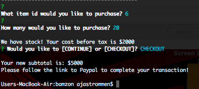

# bamzon
Amazon like storefront using node.js &amp; mysql

The user can be a customer or a manager.

## Customer Interface 
To use the customer interface the user will enter "node bamazonCustomer.js",
which will load the Product View:

Then the customer can choose an item id & quantity to buy.
The app return the cost before tax and ask to continue or checkout

If the customer chooses to continue, the app will show the final cost.

## Manager Interface
To use the manager interface the user will enter "node bamazonManager.js"
which load the Manager Menu:

### View Products
If the user chooses to view products for sale. This view is different than
the customer view, it includes the quantity.

If the user chooses to view low inventory products